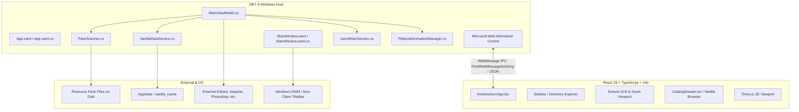

# Technical Architecture — McTextureGhost

## 1. System Topology

McTextureGhost is built as a hybrid desktop application combining .NET 8 WPF with an embedded WebView2 runtime rendering a React 19 / TypeScript single-page application.

---

## 2. Core Subsystems

### A. WPF Desktop Host (`.NET 8`)
- **`Views/MainWindow.xaml` / `Views/MainWindow.xaml.cs`**: Native shell, title bar, window behavior, and WebView2 hosting.
- **`ViewModels/MainViewModel.cs`**:
  - Acts as state hub and command processor.
  - Handles two-way IPC messaging between C# and the React web app.
  - Coordinates file system monitoring via debounced `FileSystemWatcher`.
- **`Services/`**:
  - `PackScanner.cs`: Reads `manifest.json`, `textures/terrain_texture.json`, `textures/item_texture.json`, and directory trees. Identifies ghosts, orphans, and declared textures.
  - `VanillaDataService.cs`: Downloads and caches schemas and `en_US.lang` from `Mojang/bedrock-samples`.
  - `JsonWriterService.cs`: Scaffolds new texture definitions and formats Bedrock JSON structures.
  - `PlaceholderImageFactory.cs`: Generates 16x16 checkerboard PNGs in memory and writes to disk.
  - `OpenWithLauncher.cs`: Shell launcher invoking native Windows open-with dialogs.

### B. Frontend Subsystem (`frontend/`)
- **React 19 & TypeScript**: Component tree rendering the sidebar, texture grid, catalog drawer, and inspector.
- **Three.js Viewport**: Real-time 3D preview of Minecraft block models and applied texture mappings.
- **Vite Bundler**: Configured to output standalone bundle to `frontend/dist/` or serve locally during dev.
- **Styling Architecture**: Authentic typography and Fluent styling using pure CSS Modules (`*.module.css`) without utility frameworks.

### C. IPC Bridge & Communication Contract
- Communication between C# and WebView2 occurs over JSON messages:
  - **C# to JS**: `webView.CoreWebView2.PostWebMessageAsString(json)`
  - **JS to C#**: `window.chrome.webview.postMessage(payload)`
- Envelope: `type`, `payload`, and correlation/timestamp metadata. Canonical message names and payload definitions live in `Services/IpcContracts.cs` and `frontend/src/types/ipc.ts`; update both sides together when changing a contract.
- Frontend sending, subscriptions, and correlated request-response helpers live in `frontend/src/hooks/useIpc.ts`.
- Backend dispatch lives in `Services/IpcBridgeService.cs`; `ViewModels/MainViewModel.cs` coordinates application command handling.

---

## 3. Data Models
- **`TextureAlias`**: Represents an individual texture entry with its status (`OK`, `Ghost`, `Orphan`, `Vanilla`), variant arrays, face slot mappings, and thumbnail source.
- **`BlockGroupNode`**: 3-level catalog hierarchy nodes (`BlockGroupNode` $\rightarrow$ `TextureAlias` $\rightarrow$ `LeafVariant`).
- **`ManifestModel`**: Strongly-typed model for Minecraft `manifest.json`.
- **`FlipbookDefinition`**: Frame sequences, timing, and crossfade configs from `flipbook_textures.json`.
