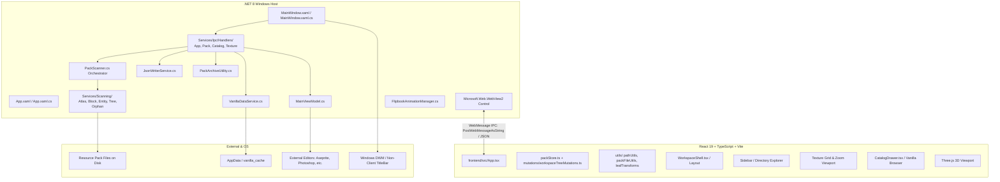

# Technical Architecture — McTextureGhost

## 1. System Topology

McTextureGhost is built as a hybrid desktop application combining .NET 8 WPF with an embedded WebView2 runtime rendering a React 19 / TypeScript single-page application.

---

## 2. Core Subsystems

### A. WPF Desktop Host (`.NET 8`)
- **`Views/MainWindow.xaml` / `Views/MainWindow.xaml.cs`**:
  - Native shell, title bar, window behavior, and WebView2 hosting.
  - Registers modular domain IPC handlers on initialization (`RegisterIpcHandlers`).
- **`ViewModels/MainViewModel.cs`**:
  - Acts as central state hub, status message broadcaster, and pack lifecycle coordinator.
  - Coordinates file system monitoring via debounced `FileSystemWatcher`.
- **`Services/Ipc/Handlers/` (Domain IPC Dispatch)**:
  - `AppIpcHandlers.cs`: App-level commands (`APP:READY`, external links, devtools).
  - `PackIpcHandlers.cs`: Pack lifecycle (`PACK:OPEN`, `PACK:CREATE`, `PACK:EXPORT`, manifest mutations).
  - `CatalogIpcHandlers.cs`: Vanilla & reference catalog downloads and block/alias additions (`VANILLA:ADD`).
  - `TextureIpcHandlers.cs`: Texture file mutations, variations, external editor launches, and drop imports.
- **`Services/Scanning/` (Pack Scanner Subsystem)**:
  - `PackScanner.cs`: High-level lean orchestrator coordinating the multi-stage scanning pipeline.
  - `TextureAtlasParser.cs`: Parses `terrain_texture.json`, `item_texture.json`, and `flipbook_textures.json`.
  - `BlockDefinitionParser.cs`: Parses `blocks.json`, texture sets, and face bindings.
  - `EntityDefinitionParser.cs`: Parses Bedrock client entities and attachables (`entity/*.json`, `attachables/*.json`).
  - `WorkspaceTreeBuilder.cs` (partials `.Block.cs`, `.Entity.cs`): Builds 3D hierarchical trees for Catalog, Block, and Entity workspaces.
  - `OrphanResolver.cs`: Disk file enumeration, orphan classification, and companion atlas/MERS pairing.
  - `ScanningJsonUtils.cs`: Shared high-performance JSON reader options and shared file streams.
- **`Services/PackArchiveUtility.cs`**:
  - Centralized zip reading, in-memory archive extraction, and export routines.
- **`Services/VanillaDataService.cs`**:
  - Downloads, parses, and caches schemas and `en_US.lang` from `Mojang/bedrock-samples`.
- **`Services/JsonWriterService.cs`**:
  - Scaffolds new texture definitions and formats Bedrock JSON structures.

### B. Frontend Subsystem (`frontend/`)
- **React 19 & TypeScript**: Component tree rendering the sidebar, texture grid, catalog drawer, and inspector.
- **State & Pure Mutations**:
  - `store/packStore.ts`: Global state container with optimistic updates.
  - `store/mutations/workspaceTreeMutations.ts`: Pure immutable mutation algorithms for add/delete/scaffold operations on hierarchical workspace trees.
- **Shared Foundation Utilities (`utils/`)**:
  - `pathUtils.ts`: Centralized path normalization, stem/filename extraction, and extension matching.
  - `packFileUtils.ts`: Efficient manifest and JSON file existence queries across pack trees.
  - `leafTransforms.ts`: Standardized DTO conversions between `CatalogLeafDto` and `TextureAliasDto`.
- **Workspace Architecture**:
  - `components/workspace/WorkspaceShell.tsx`: Unified layout shell providing consistent header, responsive off-canvas drawer toggles, and 3D viewport containers across Block and Entity workspaces.
- **Three.js Viewport**: Real-time 3D preview of Minecraft block models and Bedrock entity bone hierarchies with box UV unwrapping.
- **Vite Bundler**: Configured to output standalone bundle to `frontend/dist/` or serve locally during dev.
- **Styling Architecture**: Authentic typography and Fluent styling using pure CSS Modules (`*.module.css`) without utility frameworks.

### C. IPC Bridge & Communication Contract
- Communication between C# and WebView2 occurs over JSON messages:
  - **C# to JS**: `webView.CoreWebView2.PostWebMessageAsString(json)`
  - **JS to C#**: `window.chrome.webview.postMessage(payload)`
- Envelope: `type`, `payload`, and correlation/timestamp metadata. Canonical message names and payload definitions live in `Services/IpcContracts.cs` and `frontend/src/types/ipc.ts`; update both sides together when changing a contract.
- Frontend sending, subscriptions, and correlated request-response helpers live in `frontend/src/hooks/useIpc.ts`.
- Backend dispatch lives in `Services/IpcBridgeService.cs`; `Services/Ipc/Handlers/` executes domain-specific handlers on background threads.

---

## 3. Data Models
- **`TextureAlias`**: Represents an individual texture entry with its status (`OK`, `Ghost`, `Orphan`, `Vanilla`), variant arrays, face slot mappings, and thumbnail source.
- **`BlockGroupNode`**: 3-level catalog hierarchy nodes (`BlockGroupNode` $\rightarrow$ `TextureAlias` $\rightarrow$ `LeafVariant`).
- **`ManifestModel`**: Strongly-typed model for Minecraft `manifest.json`.
- **`FlipbookDefinition`**: Frame sequences, timing, and crossfade configs from `flipbook_textures.json`.
