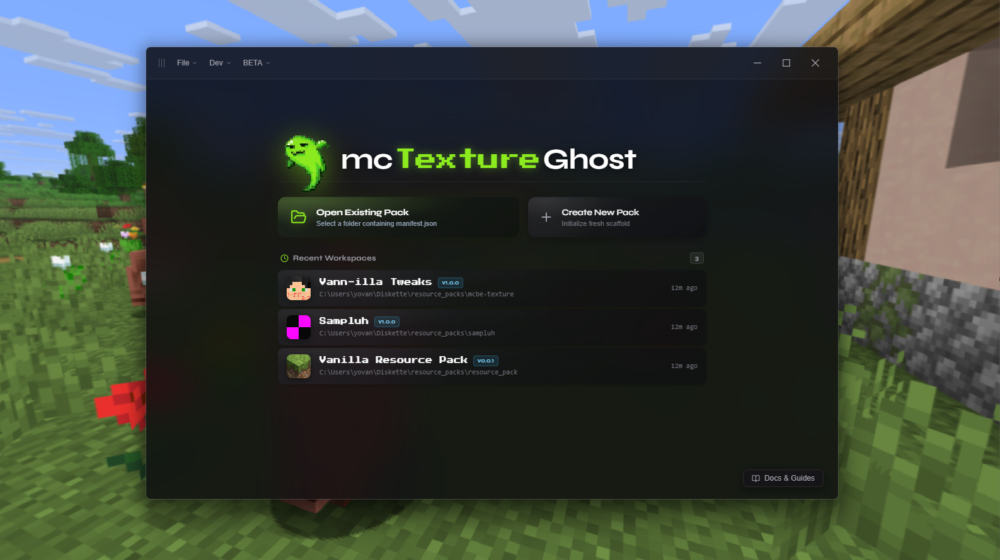
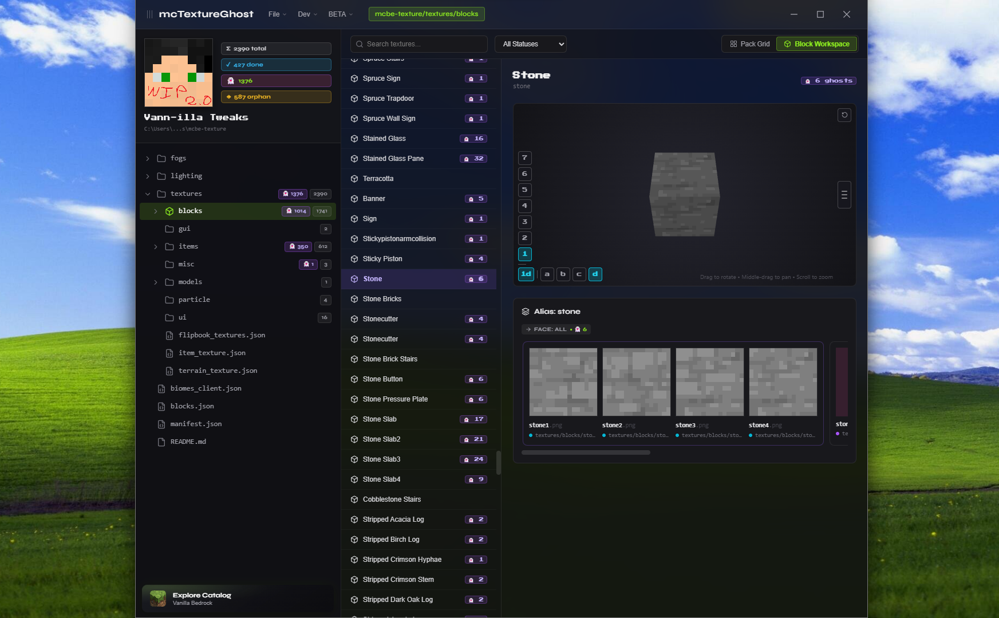

# mcTextureGhost

**Minecraft texture pack workspace for resource pack creators or to curate your own texture collection.**

Stop chasing "ghost". mcTextureGhost scans your pack, shows you every declared texture entries that doesn't exist yet ("ghosts"). No JSON wrangling required.



This program is for you to make the process of texturing a Minecraft pack easier and faster. I wanted an app to see all my textures in one place, and to see all the textures I need to make in one place, for now this app only supports bedrock `resource-pack` format



---

## What it does

### Ghost Detection

Every texture alias declared in your ex: `terrain_texture.json` or `item_texture.json` that has no artwork on disk is flagged as a **ghost** 👻. The pack grid surfaces all of them at a glance. Click any ghost to generate a placeholder stub and jump into your editor.

### Live Reload

Save in Aseprite, Photoshop, or Paint and the tile updates instantly — no app restart, no manual refresh. The watcher debounces properly so it doesn't fire mid-save.

### Block Workspace

A relational 4-tier view of your pack's block texture hierarchy: Block → Alias → Variant → Face. Useful when a single block alias has state variants, random cosmetic variations, or multiple directional faces that need to be managed together.

### Vanilla Reference Catalog

Browse the full official Bedrock texture catalog (`Mojang/bedrock-samples`) without leaving the app. Find any block or item, see its in-game name, face assignments, and variants — then add it to your pack's JSON with one click. The catalog caches locally so it works offline.

### Flipbook Animation Previews

Animated textures (`flipbook_textures.json`) so what you see in the app is what you'll see in-game.

### Manifest Editor

Create new packs or edit `manifest.json` without touching raw JSON. Name, description, format version, min engine version, and one-click UUID regeneration.

### Folder Explorer

Sidebar tree of your pack's directory structure with live texture and ghost counts per folder. Click a folder to filter the main view to just that directory.

---

## Roadmap

- [X] Block and item texture scanning with ghost detection
- [X] Live reload on external editor save
- [X] Flipbook animation playback (20Hz, GPU blending)
- [X] Vanilla Bedrock reference catalog with offline cache
- [X] JSON scaffolding (blocks, aliases, items, flipbooks)
- [X] Pack creation wizard and manifest editor
- [X] Block Workspace — 4-tier relational hierarchy view
- [X] Context menu: block state formatting and deletion
- [ ] Entity texture atlas and model texture mapping
- [ ] UI and particle texture support
- [X] `.tga` format decoding and preview
- [ ] Per-texture vanilla reference preview alongside stubs
- [ ] Target Bedrock engine version selector

---

## Getting Started

### Environment

**Requirements:** Windows 10 / 11, [.NET 8.0 Desktop Runtime](https://dotnet.microsoft.com/download/dotnet/8.0)

```powershell
git clone https://github.com/navoyovan/mcTextureGhost.git
cd McTextureGhost
dotnet run --project McTextureGhost.csproj
```

### App Release

No releases yet :(

---

## License

McTextureGhost is source-available under the [Business Source License 1.1](./LICENSE).

- Free for personal, educational, and non-commercial use.
- Cannot be resold or repackaged as a commercial product without a separate agreement.
- Automatically converts to **Apache 2.0** four years after each release date.

Contributions welcome — first-time contributors will be prompted to sign the [CLA](./CLA.md) when opening a pull request. Questions about commercial licensing? Open an issue.

---

> **NOT AN OFFICIAL MINECRAFT PRODUCT. NOT APPROVED BY OR ASSOCIATED WITH MOJANG OR MICROSOFT.**
