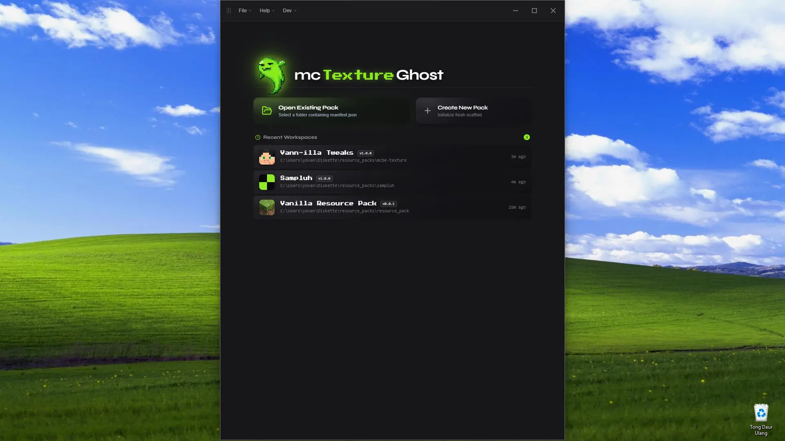
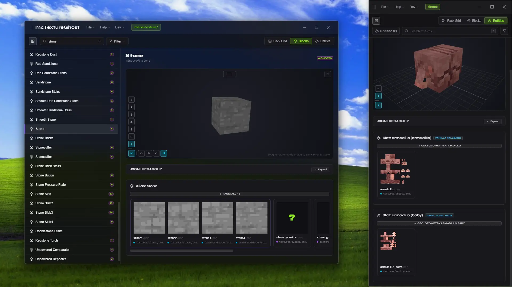
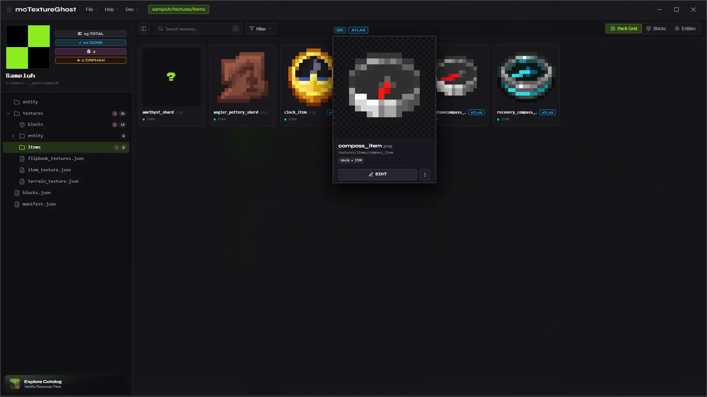

# mcTextureGhost

**Minecraft texture pack workspace for resource pack creators or to curate your own texture collection.**

Stop chasing "ghost". mcTextureGhost scans your pack, shows you every declared texture entries that doesn't exist yet ("ghosts"). No JSON wrangling required.



Built to make texturing Minecraft packs faster and less tedious. It gives you a single workspace to inspect existing textures alongside all the missing ones you still need to create. For now only support Bedrock `resource-pack` formats.





---

## What it does

<video src="frontend/public/tut.mp4" controls autoplay loop muted playsinline height="360"></video>

### Ghost Detection

Every texture alias declared in your ex: `terrain_texture.json` or `item_texture.json` that has no artwork on disk is flagged as a **ghost** 👻. The pack grid surfaces all of them at a glance. Click any ghost to generate a placeholder stub and jump into your editor.

### Live Reload

Save in Aseprite, Photoshop, or Paint and the tile updates instantly; no app restart, no manual refresh.

### Block Workspace

A relational 4-tier view of your pack's block texture hierarchy: Block → Alias → Variant → Face, paired with an interactive 3D block viewport. Useful when a single block alias has state variants, random cosmetic variations, or multiple directional faces that need to be managed together.

### Entity Workspace

3D visualizer and relational hierarchy for Bedrock entities and attachables. Maps client definitions (`entity/*.json`, `attachables/*.json`) to their Bedrock `.geo.json` bone geometries and texture slots with live 3D previews and slot variation cycling.

### Vanilla Reference Catalog

Browse the full official Bedrock texture catalog (`Mojang/bedrock-samples`) without leaving the app. Find any block or item, see its readable name, face assignments, and variants; then add it to your pack's JSON with one click. The catalog caches locally so it works offline.

### Flipbook Animation Previews

Animated textures (`flipbook_textures.json`) so what you see in the app is what you'll see in-game.

### Manifest Editor

Create new packs or edit `manifest.json` without touching raw JSON. Name, description, format version, min engine version, and one-click UUID regeneration.

### Folder Explorer

Sidebar tree of your pack's directory structure with live texture and ghost counts per folder. Click a folder to filter the main view to just that directory.

---

## Getting Started

### Environment

**Requirements:** Windows 10 / 11, [.NET 8.0 Desktop Runtime](https://dotnet.microsoft.com/download/dotnet/8.0)

```powershell
git clone https://github.com/navoyovan/mcTextureGhost.git
cd McTextureGhost
dotnet run --project McTextureGhost.csproj
```

### App Release

Download the latest standalone release binary from [GitHub Releases](https://github.com/navoyovan/mcTextureGhost/releases/tag/v1.0.0).

---

## License

McTextureGhost is source-available under the [Business Source License 1.1](./LICENSE).

- Free for personal, educational, and non-commercial use.
- Cannot be resold or repackaged as a commercial product without a separate agreement.
- Automatically converts to **Apache 2.0** four years after each release date.

Contributions and feedback are welcome! For bug reports, feature requests, or questions about commercial licensing, feel free to [open an issue](https://github.com/navoyovan/mcTextureGhost/issues).

---

> **NOT AN OFFICIAL MINECRAFT PRODUCT. NOT APPROVED BY OR ASSOCIATED WITH MOJANG OR MICROSOFT.**
